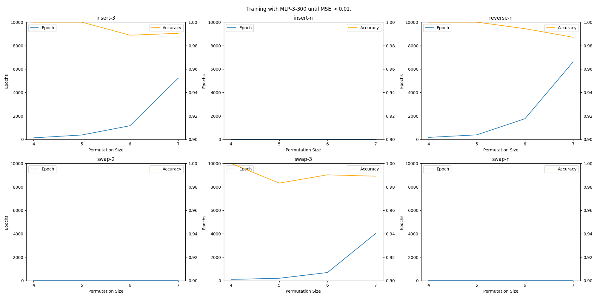

<a name="readme-top"></a>

<!-- TITLE -->
<div align="center">
  <h3 align="center">Measuring the Complexity of Short Swaps using Neural Networks</h3>
  <strong>Mark Kevn A. Ong Yiu · David Demitri Africa · Carlo Gabriel Pastor</strong>
  <br />
  <br />
  <p align="center">
    A capstone project in partial fullfillment of the Masters in Data Science course at the Ateneo de Manila University.
    <br />
    <a href="https://github.com/ongyiumark/analyzing-short-swaps"><strong>Explore the docs »</strong></a>
    <br />
    <br />
    <a href="https://github.com/ongyiumark/analyzing-short-swaps">View Demo</a>
    ·
    <a href="https://github.com/ongyiumark/analyzing-short-swaps/issues">Report Bug</a>
    ·
    <a href="https://github.com/ongyiumark/analyzing-short-swaps/issues">Request Feature</a>
  </p>
</div>

<!-- TABLE OF CONTENTS -->
<details>
  <summary>Table of Contents</summary>
  <ol>
    <li>
      <a href="#about-the-project">About The Project</a>
      <ul>
      <li><a href="#methods">Methods</a></li>
      </ul>
    </li>
    <li><a href="#initial-results">Initial Results</a></li>
    <li><a href="#usage">Usage</a></li>
    <li><a href="#roadmap">Roadmap</a></li>
    <li><a href="#contributors">Contributors</a></li>
  </ol>
</details>


<!-- ABOUT THE PROJECT -->
## About The Project
We aim to measure the complexity an optimal sorting algorithm for [short swaps](https://pubmed.ncbi.nlm.nih.gov/14633399/) using neural networks. 

We do this by training a dense neural network (DNN) to predict the next permutation in an optimal sequence of permutations. 

Consider the permutation `[1,3,4,2]`. It can be shown that the minimum number of short swaps to sort this permutation is `2`. In particular, $$[1,3,4,2] \longrightarrow [1,2,4,3] \longrightarrow [1,2,3,4]$$

We train our neural network to take `[1,3,4,2]` as input and `[1,2,4,3]` as output. Similarly, we also train the neural network to take `[1,2,4,3]` as input and `[1,2,3,4]` as output. We do this for all permutations of a particular size.

### Methods

We train a DNN with 3 hidden layers, each with $300$ nodes. This was arbitrarily chosen to give the network a sufficient amount of complexity to learn to predict the next permutation. 

We also used a Leaky ReLU activation function and a mean square error (MSE) loss function. This was optimized using the Adam optimizer algorithm with a learning rate of $0.01$.

We continue to train the DNN over several epochs until the MSE is $0.01$ or less. However, to save time and resources, we stop training after $10,000$ epochs regardless of the MSE. Finally, we keep track of the number of epochs it took to terminate for each permutation size.

We compare our results for _short swaps_ with the same methods applied to other sorting bounds.

<p align="right">(<a href="#readme-top">back to top</a>)</p>

<!-- RESULTS -->
## Initial Results

Our results can be found in `epoch-results.csv`.



<p align="right">(<a href="#readme-top">back to top</a>)</p>


<!-- USAGE -->
## Usage

### Permutation Converter
Instead of storing the each permutation in our data set, we can represent it with a single index where the index of a permutation $p$ is the number of permuations $q$ such that $q$ is lexicographically smaller than $p$.

In other words, the index of the permutation $p$ is the index of $p$ when all possible permutations are sorted in an array.

We have written an algorithm that converts a permutation to its index and vice versa in $O(n\log n)$ where $n$ is the size of the permutation. The algorithm can be found in `converter.cpp` of the `data-generators` directory, which can be executed using `converter_cli.exe` on windows or `converter_cli` on linux.

To convert an index to a permutation, we use the `-i` flag, and to convert a permutation to its index, we use the `-p` flag.
```sh
./converter_cli.exe -i [index] [size of permutation]
```

```sh
./converter_cli.exe -p [space-separated permutation]
```

Examples are shown below.
```sh
./converter.exe -i 3 4
>>> 1 3 4 2
```

```sh
./converter.exe -p 5 4 3 2 1
>>> 119
```

### Generators
1. Compile the generators into a binary
    ```sh
    g++ swap-gen.cpp -O3 -o swap-gen
    g++ insert-gen.cpp -O3 -o insert-gen
    g++ reverse-gen.cpp -O3 -o reverse-gen
    ```
2. Run the binary
    ```sh
    ./swap-gen N M [DIR]
    ```
    where `N` is the length of the permutation, and `M` is the bound for swaps. For example, adjacent swap is `M=2` and short swap is `M=3`.

    `DIR` is an optional name for the subdirectory where the data will be saved. By default, the subdirectory is `[M]swap`.

    <br />

    ```sh
    ./insert-gen N M [DIR]
    ```
    where `N` is the length of the permutation, and `M` is the bound for inserts.

    `DIR` is an optional name for the subdirectory where the data will be saved. By default, the subdirectory is `[M]insert`.

    <br />

    ```sh
    ./insert-gen N M [DIR]
    ```
    where `N` is the length of the permutation, and `M` is the bound for inserts.

    `DIR` is an optional name for the subdirectory where the data will be saved. By default, the subdirectory is `[M]insert`.

<p align="right">(<a href="#readme-top">back to top</a>)</p>


<!-- ROADMAP -->
## Roadmap
- [x] Generate data for various swapping bounds
- [x] Create a pipeline to train neural networks
- [x] Generate data for various reversal bounds
- [x] Generate data for various insertion bounds
- [x] Generate data for various block swapping bounds
- [x] Compress data set by storing index of permutation
- [ ] Implement other measures
- [ ] Implement reinforcement learning

<p align="right">(<a href="#readme-top">back to top</a>)</p>


<!-- CONTRIBUTORS -->
## Contributors
- [Mark Kevin A. Ong Yiu](https://github.com/ongyiumark)
- [David Demitri Africa](https://github.com/DavidDemitriAfrica)

<p align="right">(<a href="#readme-top">back to top</a>)</p>